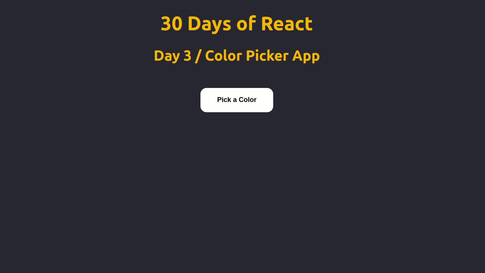

This project is a tutorial on how to make a Clock using CSS and Javascript. The
full video of this tutorial can be found on :
<a href="https://youtu.be/vVBRhjBzd0k">Click Here</a> (Right Click & Open in New
Tab)

## Demo

